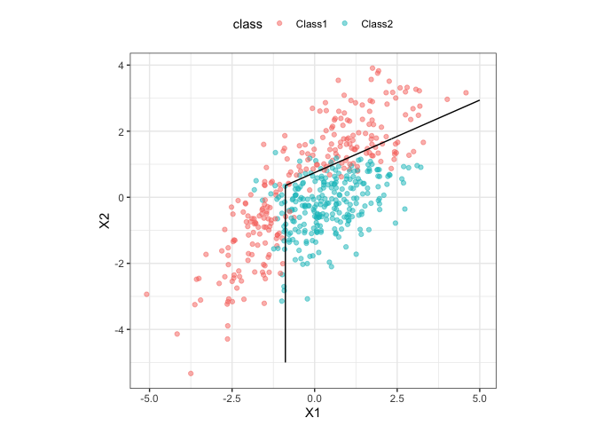

<!-- README.md is generated from README.Rmd. Please edit that file -->

# discrim

<!-- badges: start -->

[](https://www.tidyverse.org/lifecycle/#experimental)
[](https://dev.azure.com/tidymodels/discrim/_build/latest?definitionId=1&branchName=master)
[](https://dev.azure.com/tidymodels/discrim/_build/latest?definitionId=1&branchName=master)
[](https://travis-ci.org/tidymodels/discrim)
[](https://codecov.io/gh/tidymodels/discrim?branch=master)
[](https://dev.azure.com/tidymodels/discrim/_build/latest?definitionId=1&branchName=master)
<!-- badges: end -->

`discrim` contains simple bindings to enable the `parsnip` package to
fit various discriminant analysis models, such as

  - Linear discriminant analysis (LDA, simple and L2 regularized)
  - Regularized discriminant analysis (RDA, via [Friedman
    (1989)](https://scholar.google.com/scholar?hl=en&as_sdt=0%2C7&q=%22Regularized+Discriminant+Analysis%22&btnG=))
  - Flexible discriminant analysis (FDA) using MARS features
  - Naive Bayes models

## Installation

``` r
devtools::install_github("tidymodels/discrim")
```

## Example

Here is a simple model using a simulated two-class data set contained in
the package:

``` r
library(discrim)
#> Loading required package: parsnip

parabolic_grid <-
  expand.grid(X1 = seq(-5, 5, length = 100),
              X2 = seq(-5, 5, length = 100))

fda_mod <-
  discrim_flexible(num_terms = 3) %>%
  # increase `num_terms` to find smoother boundaries
  set_engine("earth") %>%
  fit(class ~ ., data = parabolic)

parabolic_grid$fda <-
  predict(fda_mod, parabolic_grid, type = "prob")$.pred_Class1

library(ggplot2)
ggplot(parabolic, aes(x = X1, y = X2)) +
  geom_point(aes(col = class), alpha = .5) +
  geom_contour(data = parabolic_grid, aes(z = fda), col = "black", breaks = .5) +
  theme_bw() +
  theme(legend.position = "top") +
  coord_equal()
```



## Contributing

This project is released with a [Contributor Code of
Conduct](https://contributor-covenant.org/version/2/0/CODE_OF_CONDUCT.html).
By contributing to this project, you agree to abide by its terms.

  - For questions and discussions about tidymodels packages, modeling,
    and machine learning, [join us on RStudio
    Community](https://rstd.io/tidymodels-community).

  - If you think you have encountered a bug, please [submit an
    issue](https://github.com/tidymodels/discrim/issues).

  - Either way, learn how to create and share a
    [reprex](https://rstd.io/reprex) (a minimal, reproducible example),
    to clearly communicate about your code.

  - Check out further details on [contributing guidelines for tidymodels
    packages](https://www.tidymodels.org/contribute/) and [how to get
    help](https://www.tidymodels.org/help/).
